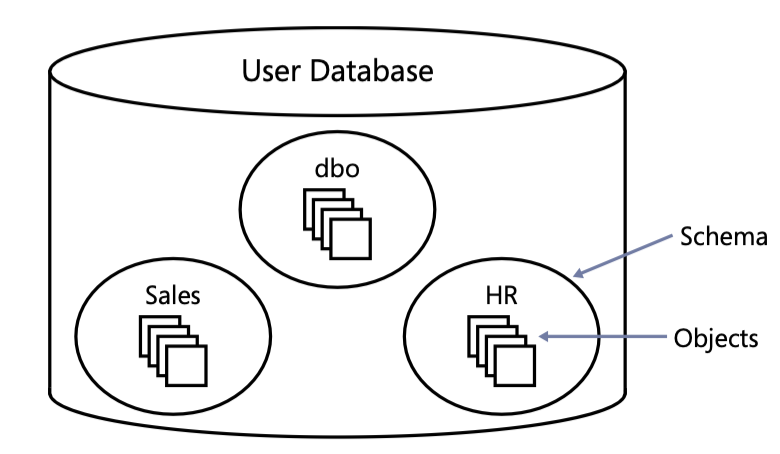

# Creating Tables and Defining Data integrity

## Create a table

```sql
USE TSQL2012;

-- Check if the table exists
IF OBJECT_ID('dbo.Employees', 'U') IS NOT NULL
  DROP TABLE dbo.Employees;

CREATE TABLE dbo.Employees (
   empid INT NOT NULL,
   firstname VARCHAR(30) NOT NULL,
   lastname VARCHAR(30) NOT NULL,
   hiredate DATE NOT NULL,
   mgrid INT NULL,
   ssn VARCHAR(20) NOT NULL,
   salary MONEY NOT NULL
)
```

<br/>

Notice the use of the two-part name *dbo.Employees* for the table name, as recommended earlier. If you omit the schema name, SQL Server will assume the default schema associated with the database user running the code.


<br/>

## Coding Style
Use a style that you and your fellow developers are comfortable with. What ultimately matters most is the consistency, readability, and maintability of your code. Take advantage of whitespace to facilitate readability.

It is strongly recommended to adopt the practice of terminating all statements with a semi-colon. Not only will doing this improve the readability of your code, bu tin some cases it can save you some grief. (When a semicolon is required and *not* specified, the error message SQL Server produces is not always very clear.)


<br/>


# Defining data integrity

The benefits of the relational model is that data integrity is an integral part of it.

<blockquote> Data integrity enforced as part of the model -- namely, as part of the table definitions -- is considered as <b>declarative data integrity</b>. Data integrity enforced with code - such as with stored procedures or triggers -- is considered <b>procedural data integrity</b></blockquote>


This section highlights some declarative constraints namely:

 - Primary Key constraints
 - Unique Constraints
 - Foreign Key constraints
 - Check constraints
 - Defaults constraints 


## Primary  Key Constraints
A primary key constraints enforces uniqueness of rows and also disallows *NULL* marks in the constraint attributes. **An attempt to define a primary key constraint on a column taht allows *NULL* marks will be rejected by the RDBMS.** Each table can only have one primary key.

```sql
ALTER TABLE dbo.Employees
  ADD CONSTRAINT PK_Employees
  PRIMARY KEY(empid);

```


To enforce uniqueness of the logical primary key constraint, SQL Server will create a unique index behind the scenes. **Indexes (not necessarily unique ones) are also used to speed up queries by avoiding unnecessary full table scans (simialar to indexes in books).**


<br/>


## Unique Constraints

Unique constraints enforces the uniquess of rows, allowing you to implement the concept of *alternate keys* from the relational model in your database. Unlike with primary keys, you can define multiple unique constraints within the same table. Also, a unique constraint is not restricted to columns defined as *NOT NULL*. According to standard SQL, a column with a unique constraint is supposed to allow multiple *NULL* marks (as if two *NULL* marks were different from each other). However, SQL Server's implementation rejects duplicate *NULL* marks (as if two *NULL* marks were equal to each other).

```sql 
ALTER TABLE dbo.Employees
  ADD CONSTRAINT UNQ_Employees_ssn
  UNIQUE(ssn)
```

As with a primary key constraint, SQL Server will create a **unique index** behind the scenes as the physical mechanism to enforce the logical unique constraint.


<br/>


## Foreign Key Constraints

A foreign key enforces **referential integrity**. This constraint is defined on one or more attributes in what's called the *referencing* table and points to the candidate key (primary key or unique constraint) attributes in what's called the *referenced* table.

<blockquote> The referencing and referenced tables can be one and the same </blockquote>.

The purpose of the foreign key to **RESTRICT** values allowed in the foreign key column to those that exists in the referenced columns.

```sql
IF OBJECT_ID('dbo.Orders', 'U') IS NOT NULL
   DROP TABLE dbo.Orders


CREATE TABLE dbo.Orders (
  orderid INT NOT NULL,
  empid INT NOT NULL,
  custid VARCHAR(10) NOT NULL,
  orderts DATETIME2 NOT NULL, 
  qty INT NOT NULL
  CONSTRAINT PK_Orders
    PRIMARY KEY(orderid)
);

```

Suppose to you want to restrict the values in ```empid``` column in the *Orders* table to the values that exist in the ```empid``` column in the *Employees* table, you can define a foreign key in the *Orders* table as follows:

```sql
ALTER TABLE dbo.Orders
  ADD CONSTRAINT FK_Orders_Employees
  FOREIGN KEY (empid)
  REFERENCES dbo.Employees(empid)
```
As illustrated below, a database contains schemas, and schemas contain objects. You can think of a schema as a container of objects such a tables, views, stored procedures, and others.



<br/>

## Schemas and Security
You can control permissions at the schema level. For example, you can grant a user ```SELECT``` permissions on a schema, allowing the user to query data from all object in that schema.

<br/>

## Schemas as namespaces
The schema is also a **namespace** -- it is used as a prefix to the object name. For example, supposed you have a table named *Orders* in a schema named *Sales*. The **schema-qualified** object name (also known as the ***two-part object name***) is ***Sales.Orders***.

If you omit the schema name when referring to an object, SQL server will a apply a process to resolve the schema name, such as checking whether the object exists in the user's default schema, and if it doesn't checking whether it exists in the *dbo* schema.

<blockquote> Microsoft recommends that when you refer to objects in your code you always use the two-part object names </blockquote>

There are some relatively insignificant costs involved in resolving the object name whe you don't specify it explicitly. But as insignificant as this extra cost might be, why pay it?


<blockquote>Note that <i>NULL</i> marks are allowed in the foreign key columns even if there are no NULL marks in the referenced candidate key columns.</blockquote>


